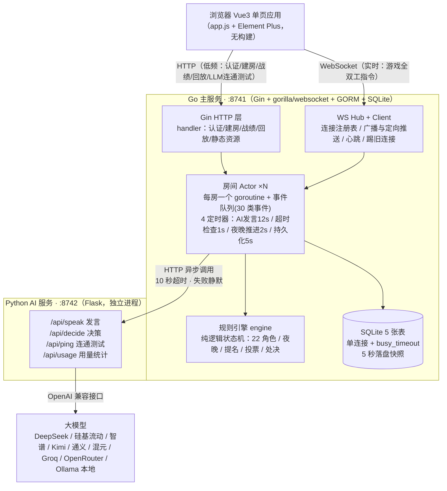

# 血染钟楼・暗流涌动 线上多人桌游网站 —— 项目说明

> 本文档基于 
>
> `F:\毕设`
>
>  目录下全部源码逐行核对整理（2026-09 版），覆盖业务逻辑、系统架构、前后端职责、技术栈、每个功能板块的实现位置、调用的类型 / 函数以及检索与校验的参数。


***

## 一、项目概述与业务逻辑

### 1.1 玩法简介

多人线上社交推理桌游，完整实现《血染钟楼・暗流涌动》（Trouble Brewing）官方规则。支持 **6–12 名玩家（真人 + AI 混玩）**，无玩家淘汰，通过 "夜晚信息 → 白天讨论 → 提名处决" 循环推理出恶魔阵营。

**阵营与角色（共 22 个 + 2 个说书人信息步骤）：**


| 阵营         | 角色                                               |
| ---------- | ------------------------------------------------ |
| 镇民（13）     | 占卜师、共情者、僧侣、送葬者、守鸦人、厨师、洗衣妇、图书管理员、调查员、贞洁者、猎手、士兵、镇长 |
| 外来者（4）     | 管家、酒鬼、陌客、圣徒                                      |
| 爪牙（4）      | 投毒者、间谍、红唇女郎、男爵                                   |
| 恶魔（1）      | 小恶魔                                              |
| 说书人信息步骤（2） | minion\_info（爪牙互认）、demon\_info（恶魔知爪牙 + 不在场镇民）    |

**核心机制：**


* **夜晚**：按官方顺序表逐步执行（首夜 11 步、其他夜 10 步），每步 2 秒自动推进；真人主动选择型角色（占卜师 / 僧侣 / 管家 / 投毒者 / 小恶魔）挂起 45 秒做选择，超时引擎自动代选。

* **中毒（横切规则）**：信息类角色（占卜师 / 共情者 / 送葬者 / 守鸦人 / 厨师等）返回**假结果**；效果类角色（僧侣 / 投毒者）**流程照常、效果不写入**；恶魔免疫投毒；死亡 > 中毒（死亡角色直接跳过）；玩家无感知（`Poisoned` 字段 `json:"-"` 不序列化）。

* **处决**：提名阶段一轮可多组提名；30 秒冷却到期**汇总全部被提名者票数，唯一最高票且 >0 者处决**，平票或 0 票无人处决。

* **特殊规则**：猎手白天开枪、贞洁者被提名反杀、士兵恶魔免疫、镇长（3 人存活且当日未处决则好人胜 + 提名 2 票）、圣徒被处决好人判负、酒鬼伪装成不在场镇民且线索错误、小恶魔首夜禁刀 / 5% 自杀传位、红唇女郎恶魔死后继承（存活 ≥5 人）。

### 1.2 对局流程（相位状态机）


```
waiting（等待）

&#x20; → night（夜晚：按官方顺序表 2 秒/步；真人挂起 45 秒卡片选择）

&#x20; → day（黎明：公布死亡、守鸦人显灵、红唇女郎继承、胜负检查）

&#x20; → private\_chat（私聊：点击玩家条目邀请，一对一面板切换，AI 自动接受）

&#x20; → public\_chat（公聊：AI 异步发言）

&#x20; → nomination（提名：点击条目提名 → 20 秒辩论仅双方发言 → 20 秒投票可反复切换 → 30 秒冷却窗口）

&#x20; → night（循环）／游戏结束
```

相位由 `engine.Engine.AdvancePhase()` 驱动，房间层 2 秒定时器调用；夜晚挂起时自动推进暂停，由真人提交或 45 秒超时代选恢复。

### 1.3 胜负判定（`engine.CheckWin()`）


| 条件                   | 结果        |
| -------------------- | --------- |
| 场上存活恶魔数 = 0          | 善良胜（good） |
| 仅 3 人存活且镇长存活且当日无人被处决 | 善良胜（good） |
| 存活人数 ≤ 2             | 邪恶胜（evil） |


***

## 二、系统架构




### 2.1 分层职责


| 层            | 职责                     | 关键约束                  |
| ------------ | ---------------------- | --------------------- |
| 浏览器          | 界面渲染、WS 指令收发、本地卡片交互    | 无业务规则，全部状态由服务端广播      |
| Go 主服务       | 认证、房间管理、游戏规则、AI 调用、持久化 | HTTP 只做低频操作；实时游戏全走 WS |
| Python AI 服务 | 大模型推理（发言 / 决策）         | 独立进程，宕机不影响游戏主流程       |
| 大模型          | 文本生成                   | 任意 OpenAI 兼容接口，座位级配置  |

### 2.2 核心设计决策（对照代码）


1. **房间 Actor 模型**（`internal/room/room.go`）：每房间一个 goroutine + 事件队列（缓冲 64），所有 WS 指令经 handler 映射为 `room.Event` 投递进队列串行处理，**天然免锁**，房间之间互不阻塞。

2. **引擎与 IO 分离**（`internal/engine`）：`Engine` 是纯逻辑状态机，不碰网络 / 数据库 / 广播；可独立单元测试。广播、持久化全部由 room 层负责。

3. **WS 全双工**：游戏实时性要求高，所有指令（发言 / 提名 / 投票 / 私聊 / 夜间选择）走 `/ws`；HTTP 仅承担认证、建房、战绩、回放、LLM 连通测试、静态资源。

4. **SQLite 单连接**：连接池强制 =1 + `busy_timeout`，单机毕设场景避免并发写锁竞争。

5. **AI 进程隔离**：AI 调用全部放在独立 goroutine 异步回投；Go 侧 HTTP 超时 10 秒，失败返回空、不广播（实测 AI 服务宕机游戏不卡）。

6. **对局持久化**：每 5 秒落盘对局快照 JSON 到 `rooms.game_data`，服务重启后 `mgr.Restore()` 热恢复（角色 / 相位 / 挂起不丢失）；空置 3 分钟自动复位、纯 AI 等待房间立即销毁。

7. **聊天卡片式交互**：夜间技能定向卡片（仅本人可见）、投票 / 提名 / 结果广播卡片，零模态弹窗。


***

## 三、技术栈与框架


| 层       | 语言                       | 框架 / 库                                                                                                           | 端口   | 说明                                     |
| ------- | ------------------------ | ---------------------------------------------------------------------------------------------------------------- | ---- | -------------------------------------- |
| 游戏主服务   | Go                       | Gin、gorilla/websocket、GORM、[golang.org/x/crypto/bcrypt](https://golang.org/x/crypto/bcrypt)、gin-contrib/sessions | 8741 | 主进程；pprof 调试端口 8790                    |
| AI 推理服务 | Python                   | Flask、requests                                                                                                   | 8742 | 独立进程，只做大模型推理                           |
| 前端      | JavaScript（Vue3 组合式 API） | Vue3、Element Plus（CDN / 本地 vendor）                                                                               | —    | 无构建工具，单文件 `static/js/app.js`（约 1400 行） |
| 数据库     | SQLite                   | GORM                                                                                                             | —    | 单连接 + busy\_timeout                    |

**关键环境变量**（`internal/config/config.go`）：`BOTC_HUMAN_CHOICE`（真人夜间交互开关，默认 true）、`BOTC_AI_CHAT_INTERVAL`（AI 公聊间隔，默认 12 秒）、`DEEPSEEK_API_KEY` / `LLM_BASE_URL` / `LLM_MODEL`（AI 服务侧 LLM 配置）、`AI_HTTP_TIMEOUT`（AI 服务请求大模型超时，默认 90 秒）。


***

## 四、前后端职责划分


| 事项         | 前端（app.js）               | 后端（Go / Python）      |
| ---------- | ------------------------ | -------------------- |
| 界面渲染 / 交互  | ✅ 三视图（大厅 / 房间 / 游戏）、卡片渲染 | —                    |
| 业务规则       | ❌ 不参与                    | ✅ engine 规则引擎        |
| 相位推进       | ❌ 只展示                    | ✅ room 定时器驱动         |
| 数据存储       | ❌                        | ✅ SQLite 5 表         |
| 夜间行动合法性    | ❌                        | ✅ `ResolveChoice` 校验 |
| AI 发言 / 决策 | ❌                        | ✅ Python 服务 + 大模型    |
| 消息收发       | ✅ WS 收发 + 本地去重           | ✅ Hub 广播 / 定向        |

**一句话**：前端只是 "显示器 + 遥控器"，一切状态与规则都在后端。


***

## 五、功能板块实现：调用类型与参数检索

> "类" 在 Go 中为结构体（struct）与包函数，在 Python 中为路由函数；"检索参数" 指该板块读取、校验或查询的请求字段。

### 5.1 用户认证（HTTP）


| 项          | 说明                                                                                                                             |
| ---------- | ------------------------------------------------------------------------------------------------------------------------------ |
| 实现文件       | `internal/handler/handler.go`、`internal/model/model.go`                                                                        |
| 路由         | `POST /api/auth/register`、`POST /api/auth/login`、`POST /api/auth/logout`、`GET /api/me`                                         |
| 调用类型       | `handler.Handler{DB *gorm.DB, Hub *ws.Hub, Mgr *room.Manager}`、`model.User`、bcrypt 包                                           |
| 关键函数       | `Register` / `Login` / `Logout` / `Me` / `AuthRequired` / `CurrentUserID` / `setLogin`                                         |
| 检索 / 校验的参数 | `username`（长度 2–20，唯一性查询 `WHERE username = ?`）、`password`（≥6 位，bcrypt 哈希 / 比对）；session 中 `user_id` 类型断言（uint/uint64/int/int64） |
| 备注         | 密码 bcrypt 哈希存储；session `MaxAge` 7 天、HttpOnly；`AuthRequired` 中间件统一登录校验                                                          |

### 5.2 房间管理（HTTP + WS）


| 项          | 说明                                                                                                                                                                                       |
| ---------- | ---------------------------------------------------------------------------------------------------------------------------------------------------------------------------------------- |
| 实现文件       | `internal/handler/handler.go`（建房）、`internal/handler/ws.go`（事件映射）、`internal/room/room.go`（业务）                                                                                             |
| 路由 / 指令    | `POST /api/room/create`；WS：`room.join` / `room.chat` / `room.ready` / `room.add_ai` / `room.remove_ai` / `room.set_seats` / `room.start` / `room.leave` / `room.kick` / `room.fill_bots` |
| 调用类型       | `handler.Handler.CreateRoom` → `room.Manager.Create(code, hostID, username)` → `room.Room`（Actor）；`model.Room` / `model.RoomSeat`                                                        |
| 关键函数       | `CreateRoom` / `genRoomCode` / `onJoin` / `onAddAI` / `onFillBots` / `onStart` / `onKick` / `onSetSeats`                                                                                 |
| 检索 / 校验的参数 | `room_code`（6 位大写字母数字，唯一性 `Count` 查询）；`ai_type`（local/api 二选一）；`max_players`（座位数）；`user_id`（踢人目标）；人数 ≥5 才允许开局；已开局房间加入 → 观战模式（`spectator: true`）                                          |
| 备注         | 建房只走 HTTP 入口，状态全在房间 Actor；一键假人 `room.fill_bots` 补到设定人数；空置 3 分钟复位、等待房间即销毁                                                                                                                 |

### 5.3 WebSocket 通信层


| 项          | 说明                                                                                                                         |
| ---------- | -------------------------------------------------------------------------------------------------------------------------- |
| 实现文件       | `internal/ws/hub.go`、`internal/ws/client.go`、`internal/handler/ws.go`                                                      |
| 调用类型       | `ws.Hub`（全局连接注册表）、`ws.Client`（单连接）、`handler.WSHandler`（协议解析与指令映射）                                                          |
| 关键函数       | `Hub.Register` / `Hub.Unregister` / `Hub.BroadcastToRoom` / `Hub.SendToUser`；`Client` 双协程 `WritePump` / `ReadPump`         |
| 检索 / 校验的参数 | 指令名 `event`（白名单分发）；心跳 `heartbeat`；连接鉴权（session 中的 `user_id`）；`room_code` 归属校验                                              |
| 关键设计       | 心跳 50s / 超时 60s；发送缓冲 256，慢客户端直接断开防阻塞；跨设备登录踢旧连接；在线状态 5 秒防抖广播                                                                |
| 指令清单       | 第 1 层（无房间上下文）：`heartbeat`、`friend.*`（6 个）、`room.invite_*`（3 个）；第 2 层（房间内）：`room.*`（10 个）+ `game.*`（15 个），共 30 类事件投递进房间事件循环 |

### 5.4 游戏规则引擎（22 角色）


| 项          | 说明                                                                                                                                                                                                                                                                                                       |
| ---------- | -------------------------------------------------------------------------------------------------------------------------------------------------------------------------------------------------------------------------------------------------------------------------------------------------------- |
| 实现文件       | `internal/engine/game.go`（约 2000 行）、`internal/engine/roles.go`                                                                                                                                                                                                                                           |
| 调用类型       | `engine.Engine`（核心状态机）、`engine.GameData`（对局状态）、`engine.PlayerState`（玩家状态）、`engine.RoleDef` / `Roles`（角色表）、`engine.NightPendingChoice`（挂起）、`engine.NominationRecord` / `engine.VoteState`                                                                                                                 |
| 关键函数       | `NewEngine`（注入 `emit` 回调，引擎通过它广播事件，实现 IO 分离）、`StartGame` / `AssignRoles` / `AdvancePhase` / `StepNight` / `DoAction` / `ResolveChoice` / `TimeoutChoice` / `Nominate` / `StartVoting` / `CastVote` / `FinishVote` / `ResolveNominationPeriod` / `CheckWin` / `CleanTurn`                                 |
| 检索 / 校验的参数 | 角色分配：官方人数表（5–12 人 镇民 / 外来者 / 爪牙 / 恶魔 配置），男爵 +2 外来者（-2 镇民）；角色池重排（`NeedsChoice` 角色移前）+ 玩家序列重排（真人移前），真人优先拿主动角色；首夜信息：恶魔知爪牙编号 + 3 个不在场镇民（`InfoMinionNums` / `InfoNotInPlay`）、爪牙知恶魔编号（`InfoDemonNum`）、占卜师红鲱鱼（`RedHerringPID`）；酒鬼伪装不在场镇民（`FakeRole` + 编造线索）；洗衣妇 / 图书管理员 / 调查员 / 厨师 / 间谍线索在 `assignInfoClues` 生成 |
| 中毒横切       | `DoAction` 中判断 `p.Poisoned`：信息类调用 `fakeClue` / `fakeRoleName` / `fakeCount` / 占卜结果取反；效果类直接跳过写入；`Poisoned` 字段 `json:"-"` 不序列化（玩家无感知）；`CleanTurn` 回合末清中毒 / 保护 / 酒鬼                                                                                                                                         |
| 备注         | 引擎不碰网络与数据库，所有副作用通过 `emit` 回调外发 → 可完全单测                                                                                                                                                                                                                                                                   |

### 5.5 夜晚推进与真人行动（挂起）


| 项          | 说明                                                                                                                                                                                                                                    |
| ---------- | ------------------------------------------------------------------------------------------------------------------------------------------------------------------------------------------------------------------------------------- |
| 实现文件       | `internal/room/room.go`（`autoNightAdvance` / `broadcastPending` / `checkPendingTimeout` / `onSubmitChoice` / `onTipAck`）、`internal/engine/game.go`（`StepNight` / `ResolveChoice` / `TimeoutChoice` / `ChoiceTargets` / `ChoiceCount`） |
| 调用类型       | `engine.NightPendingChoice{PlayerID, Number, RoleKey, RoleName, ValidTargets, MaxTargets, StepIdx, Total, Deadline, TipID}`                                                                                                           |
| 关键函数       | `StepNight`（按 `NightOrderFirst` 11 步 / `NightOrderOther` 10 步逐步执行，2 秒 / 步由定时器驱动）；`ResolveChoice(pid, roleKey, targets, choiceType)` 校验合法性并执行技能；`TimeoutChoice` 45 秒超时代选；`ChoiceTargets` / `ChoiceCount` 计算可选目标                        |
| 检索 / 校验的参数 | `NightPendingChoice`：真人 + `ri.NeedsChoice` 才挂起；`targets` 长度必须等于 `MaxTargets`（占卜师 2、管家 1、僧侣 1、投毒者 1、小恶魔 1）；目标必须在 `ValidTargets` 内；`tip_id`（幂等标识：天 - 步骤 - 角色 - 玩家，全链路只下发一次提示卡片）；`tip_ack` 送达后**重新 45 秒计时**                              |
| 前端通道       | 双通道兜底：WS 事件 `game.night_tip` + 3 秒轮询（WS 查询 `game.my_info` / HTTP `GET /api/game/:code/pending`，3 秒超时）                                                                                                                                 |
| 备注         | 支持真人选择角色：占卜师、僧侣、管家、投毒者、小恶魔（`imp` 自杀传位时真人可选继承者 `imp_inherit`）                                                                                                                                                                          |

### 5.6 提名、投票与处决


| 项          | 说明                                                                                                                                                                                                                                        |
| ---------- | ----------------------------------------------------------------------------------------------------------------------------------------------------------------------------------------------------------------------------------------- |
| 实现文件       | `internal/engine/game.go`（`Nominate` / `StartVoting` / `CastVote` / `FinishVote` / `ResolveNominationPeriod` / `aiVoteChoice`）、`internal/room/room.go`（`onNominate` / `onVote` / `onEndNomination` / `resolveNominationPeriod`）           |
| 调用类型       | `engine.NominationRecord{FromNumber, TargetNumber, Yes, Voted...}`、`engine.VoteState{FromNumber, TargetNumber, Deadline, VoteDeadline, YesNums...}`                                                                                       |
| 关键函数       | `Nominate(fromNum, targetNum)` 校验并记录；`StartVoting` 开启 20 秒投票（辩论 20 秒到点后 AI 立即投票、辩论双方不能投）；`CastVote(num, choice)` 记录票数（可反复切换）；`FinishVote` 统计并开启 30 秒冷却；`ResolveNominationPeriod` 冷却到期统一比对 → 唯一最高且 >0 处决；`aiVoteChoice` AI 简单启发式（50% 概率同意） |
| 检索 / 校验的参数 | `target_number`（不能提名自己、死亡玩家、30 秒冷却内的目标、已被提名过的目标；`ActiveVote` 存在时拒绝新提名）；`choice`（yes/no 白名单）；处决判定：`Nominations` 中 `best.Yes` 最高且 `>0`，`tie` 平票或 `Yes==0` 无人处决                                                                              |
| 特殊规则       | 猎手提名后开枪射杀；贞洁者首次被提名 → 提名者立即处决；镇长投票 +1；处决成立直接 `AdvancePhase` 入夜（`Executed` 标记影响镇长判胜）                                                                                                                                                        |
| 备注         | 房主手动 "结束提名" 走 `EndNomination`（过半规则），主流程自动走 `ResolveNominationPeriod`（唯一最高票规则）                                                                                                                                                             |

### 5.7 私聊系统


| 项          | 说明                                                                                                                      |
| ---------- | ----------------------------------------------------------------------------------------------------------------------- |
| 实现文件       | `internal/room/room.go`（`onPrivateInvite` / `onPrivateAccept` / `onPrivateDecline` / `onPrivateChat` / `onSkipPrivate`） |
| 调用类型       | `room.Room` 私聊会话状态（按对端编号隔离）；AI 侧 `ai_private_say` 事件                                                                    |
| 关键函数       | `onPrivateInvite`（AI 自动接受并主动开场 `aiPrivateFirstLine`）；`onPrivateChat`（校验会话存在、归档消息）；`onSkipPrivate`（房主跳过私聊阶段）             |
| 检索 / 校验的参数 | `to_number`（目标玩家编号，必须存活、不能是自己）；`content`（非空、长度限制）；会话存在性校验（未建立会话不能私聊）；每会话保留 100 条                                        |
| 前端交互       | 点击玩家条目发起邀请；接受后聊天面板整体切换为一对一；非当前对象的私聊只提示不打断                                                                               |

### 5.8 AI 玩家系统（Go 客户端 + Python 服务 + 大模型）


| 项                       | 说明                                                                                                                                                                                                                                                                                                                                     |
| ----------------------- | -------------------------------------------------------------------------------------------------------------------------------------------------------------------------------------------------------------------------------------------------------------------------------------------------------------------------------------- |
| Go 侧实现                  | `internal/aiclient/client.go`：`AI{HTTP *http.Client, BaseURL, Key, Model}`；`Speak(...)` / `Decide(...)` / `Ping(...)` / `Usage(...)`；HTTP 超时 **10 秒**（注释：AI 不得阻塞房间循环，3 秒会静默丢弃导致 AI 不鸟人）                                                                                                                                                |
| Python 侧实现              | `ai_service/main.py`：Flask 路由 `POST /api/speak`（发言）、`POST /api/decide`（决策）、`POST /api/ping`（连通测试）、`GET /api/usage` + `GET /health`                                                                                                                                                                                                     |
| 调用类型                    | Python：`_ask_deepseek(messages, llm_conf, temperature, max_tokens, room_code)`（OpenAI 兼容协议，请求大模型超时 `AI_HTTP_TIMEOUT` 默认 90 秒）；`_resolve_llm(llm_conf)` 解析座位级 LLM 配置；`_ROLE_GUIDES`（22 角色指令字典）、`_EVIL_PLAYBOOK`（邪恶伪装手册）、`_DEMON_COMMAND`（恶魔指挥义务）、`_MINION_OBEY`（爪牙服从铁律）、`_EVIL_TEAM_RULES` / `_EVIL_FRAUD_TACTICS` / `_GOOD_TEAM_LOGIC` |
| 检索 / 校验的参数（/api/speak）  | `role_name`、`team`、`number`、`phase`（public\_chat/private\_chat/nomination）、`day`、`alive_nums`、`context`（最近对话，取 8 条）、`my_clues`（私密线索，取 6 条，过滤 🎭/📋 身份通知）、`llm_conf`、`room_code`、`other_num`（私聊对象）                                                                                                                                      |
| 检索 / 校验的参数（/api/decide） | `role_name`、`ability`、`alive_nums`（剔除自身）、`self_num`、`my_clues`、`llm_conf`、`room_code`；返回只取一个数字，且必须在 `candidates` 内，否则随机                                                                                                                                                                                                                |
| 结构化推理笔记                 | `_AI_NOTES[(room, number)]`：公开身份 / 怀疑 / 信任 / 战术目标 + 最近日志（上限 20 条）；发言前注入 "你的记忆"，发言后记录 "我说过"；按房间隔离                                                                                                                                                                                                                                       |
| 四层金字塔 Prompt            | 阵营核心目标（最高优先级）→ 角色规范 → 场景规则（公聊 / 私聊 / 提名分支）→ 上下文（线索 + 记忆 + 最近对话）；LLM 失败时走**兜底话术池**（`_FALLBACK_PUBLIC`/`_FALLBACK_PRIVATE`，AI 不沉默）；`_extract_identity_update` 提取发言中的身份声明写回笔记，保证身份一致性                                                                                                                                                     |
| Token 用量                | `usage.json` 落盘 + `/api/usage` 聚合（全局 / 按房间 / 按模型），前端 `GET /api/ai_usage` 展示                                                                                                                                                                                                                                                            |
| 前端 LLM 预设               | `static/js/app.js` 内置 9 家预设：DeepSeek / 硅基流动 / 智谱 / Kimi / 通义 / 混元 / Groq / OpenRouter / Ollama 本地（Ollama 免 Key）；添加前先 `POST /api/llm_ping` 连通性测试，失败立即提示不添加                                                                                                                                                                              |

### 5.9 好友系统


| 项          | 说明                                                                                                                                                                                      |
| ---------- | --------------------------------------------------------------------------------------------------------------------------------------------------------------------------------------- |
| 实现文件       | `internal/handler/friend.go`、`internal/model/model.go`                                                                                                                                  |
| 指令         | `friend.search`（username 关键词）、`friend.request` / `friend.accept` / `friend.reject` / `friend.remove` / `friend.list`、`room.invite_friend` / `room.invite_accept` / `room.invite_reject` |
| 调用类型       | `handler.FriendOps{DB, Hub, Mgr}`；`model.Friend`（规范化唯一索引）                                                                                                                               |
| 检索 / 校验的参数 | `username`（LIKE 搜索，排除自己）、`friend_id`（存在性、不能加自己、重复申请拦截、方向校验）；好友关系按（小 ID, 大 ID）规范化存储 + 组合唯一索引                                                                                             |
| 备注         | 好友在线状态广播（5 秒防抖）；房间邀请走 WS 事件，被邀请者弹卡片可接受 / 拒绝                                                                                                                                             |

### 5.10 数据持久化与热恢复


| 项          | 说明                                                                                                                                                                                                            |
| ---------- | ------------------------------------------------------------------------------------------------------------------------------------------------------------------------------------------------------------- |
| 实现文件       | `internal/room/room.go`（`persistGame` / `checkAbandoned`）、`internal/room/manager.go`（`Restore` / `Create` / `Delete`）、`internal/model/model.go`                                                               |
| 调用类型       | `model.Room{Status, GameData}`（对局快照 JSON）；`room.Manager`                                                                                                                                                      |
| 关键函数       | `persistGame`（每 5 秒 `json.Marshal(r.game)` 写 `game_data` + `status="playing"`）；`Restore`（启动时扫描 playing 房间，`restorePlayingFromDB` 重建 `engine.Engine`）；`checkAbandoned`（空置 3 分钟 `resetToWaiting`，等待房间纯 AI 立即销毁） |
| 检索 / 校验的参数 | `room_code`（按码查房间）；`status`（只恢复 playing）；`game_data` JSON 反序列化为 `engine.GameData`                                                                                                                             |
| 备注         | 角色 / 相位 / 挂起 / 夜晚索引全部包含在快照中，重启后对局无缝继续                                                                                                                                                                         |

### 5.11 战绩与回放


| 项          | 说明                                                                                                                 |
| ---------- | ------------------------------------------------------------------------------------------------------------------ |
| 实现文件       | `internal/handler/handler.go`（`MyStats` / `MyGames` / `GameReplay`）、`internal/model/model.go`（`GameLog`）           |
| 路由         | `GET /api/stats`、`GET /api/games`、`GET /api/games/:id/replay`                                                      |
| 调用类型       | `model.GameLog{UserIDs, Players, Messages, Actions, PrivateMsgs, Winner, Day...}`（对局归档 JSON）                       |
| 检索 / 校验的参数 | `user_ids LIKE "%,ID,%"`（参与者检索，前后加逗号避免前缀误匹配）；回放前校验 `strings.Contains(UserIDs, ",ID,")`（**仅参与者可看**）；`:id` 不存在返回 404 |
| 备注         | 归档内容：参与者 uid 列表、角色分配、公聊 / 私聊消息、行动日志（夜晚选择 / 提名 / 投票）                                                                |

### 5.12 前端交互（Vue3 app.js）


| 项          | 说明                                                                                                                                                                                                                                                    |
| ---------- | ----------------------------------------------------------------------------------------------------------------------------------------------------------------------------------------------------------------------------------------------------- |
| 实现文件       | `static/js/app.js`（约 1400 行，无构建，Vue3 组合式 API + Element Plus）                                                                                                                                                                                          |
| 调用类型       | `WS` 客户端对象（`connect` / `send` 返回 Promise ack / `on` 事件订阅）；`api` HTTP 封装                                                                                                                                                                               |
| 关键函数       | `enterRoom`（WS 加入 + 状态应用）、`fillBots` / `fillAndStart`（一键假人）、`addNightTip` / `submitTipChoice`（夜间定向卡片，`tip_id` 幂等去重）、`castVote`（投票可反复切换）、`nominate`（点击玩家条目提名）、`invitePrivate` / `acceptPrivate`（私聊邀请）、`applyGameState`（消息增量合并，保留本地卡片）、`openReplay`（回放） |
| 检索 / 校验的参数 | 房间码（`#join=` 邀请链接自动填码）；输入框数字序列（如 "2 5"）在挂起时解析为夜晚选择提交；`llmForm` 的 `api_key/base_url/model`（添加 AI 前先 `/api/llm_ping`）；sessionStorage 保存房间码实现刷新恢复                                                                                                        |
| 事件订阅       | `room.state` / `game.state` / `game.phase` / `game.message` / `game.night_tip` / `game.vote_start` / `game.vote_result` / `game.nominate_result` / `game.private_*` / `game.over` 等                                                                   |
| 断线恢复       | `_open` 自动 `joinRoomWS` 恢复房间 / 对局；`send` 等待连接窗口 5 秒；`game.state` 按相位恢复私聊模式与挂起卡片                                                                                                                                                                       |


***

## 六、参数检索汇总速查表


| 板块         | 检索 / 校验的关键参数                                       | 检索方式                                              |
| ---------- | -------------------------------------------------- | ------------------------------------------------- |
| 注册         | `username`（2–20、唯一）、`password`（≥6）                 | `WHERE username = ?` Count / bcrypt               |
| 登录         | `username` + `password`                            | `First` 查用户 + bcrypt 比对                           |
| 建房         | 随机 6 位码                                            | `WHERE room_code = ?` Count 防冲突                   |
| 加入房间       | `room_code`                                        | Manager 查房间 + 满员 / 开局判断                           |
| 战绩 / 回放    | `user_ids` 包含当前用户 ID                               | `LIKE "%,ID,%"` + `Contains` 权限校验                 |
| 挂起选择       | `targets` 数量 / 合法性                                 | `ChoiceCount` / `ChoiceTargets` / `ResolveChoice` |
| 提名         | `target_number` 存活 / 冷却 / 重复                       | `Nominate` 状态机校验                                  |
| 投票         | `choice` yes/no                                    | `CastVote` 白名单                                    |
| 私聊         | `to_number` 存活 / 会话存在                              | `onPrivateChat` 校验                                |
| AI 发言 / 决策 | `role_name/team/phase/alive_nums/context/my_clues` | Python 端解析 + Prompt 注入                            |
| 好友         | `friend_id` 存在 / 方向 / 重复                           | `friend.go` 事务校验                                  |
| 回放         | `:id` 存在 + 参与者                                     | `First` + `strings.Contains`                      |


***

## 七、测试与质量保障

### 7.1 单元测试（`go test -race ./...` 全绿）


| 包                    | 覆盖内容                                                                                                             |
| -------------------- | ---------------------------------------------------------------------------------------------------------------- |
| engine               | 22 角色规则：提名投票（唯一最高处决 / 并列无人 / 冷却窗口）、死亡票、中毒（占卜假结果 / 僧侣保护无效 / 投毒者无效 / 恶魔免疫 / 共情假数字 / 送葬假角色 / 厨师假线索延迟）、真人优先主动角色、首夜禁刀 |
| room                 | 夜晚挂起（管家 / 占卜师挂起）、45 秒超时代选兜底、私聊守卫、空置清理（3 分钟复位 / 回归取消 / 等待房间即销毁）、死亡隐藏（黎明前快照 alive=true）                            |
| handler / model / ws | 认证、好友、数据迁移查询、Hub 广播 / 定向推送                                                                                       |

### 7.2 端到端测试（`ui_e2e/`，node WS 脚本，需服务运行中）


| 脚本                  | 验证场景                         | 结果    |
| ------------------- | ---------------------------- | ----- |
| full\_flow\_e2e.cjs | 夜晚→私聊→公聊→提名→辩论→投票→处决 / 冷却→入夜 | 14/14 |
| night\_tip\_e2e.cjs | 夜间定向提示私有性、AI 局无提示、全链路        | 11/11 |
| priv\_fix\_e2e.cjs  | 私聊单条消息不重复、房主跳过               | 11/11 |
| persist\_e2e.cjs    | 杀服务重启后角色 / 存活恢复              | 5/5   |
| ui\_bugs\_e2e.js    | 自检面板 / 黎明私聊公聊渲染 / 公聊输入       | 8/8   |
| 其他                  | 投票按钮反复切换、卡片渲染、私聊模式、提名 UI     | ✓     |

### 7.3 稳定性专项与历史缺陷修复（回归记录 10+ 项）

黑屏（v-for+v-if 同元素崩溃）、输入框失效、挂起超时死锁、提名弹窗残留、私聊消息重复、提示卡片刷屏（TipSent 幂等 + 前端去重）、重启后房间堆积、断线 "连接未就绪"、提名死锁、多提名处决不比对票数 → 均已修复并有对应回归脚本。


***

## 八、目录结构与启动方式


```
F:\毕设\\

├── botc\_server\                Go 游戏主服务（后端核心）

│   ├── main.go                 入口：Gin 路由、SQLite 连接池=1、pprof、启动恢复

│   ├── internal\\

│   │   ├── engine\            规则引擎（game.go / roles.go + 13 个测试文件）

│   │   ├── room\              房间 Actor（room.go / manager.go + 6 个测试文件）

│   │   ├── handler\           HTTP 接口 + WS 指令映射（handler.go / ws.go / friend.go）

│   │   ├── ws\                WebSocket Hub / Client

│   │   ├── model\             GORM 模型（5 表）

│   │   ├── aiclient\          AI 服务 HTTP 客户端（10 秒超时）

│   │   └── config\            环境变量配置

│   ├── static\                前端（index.html + js/app.js + 本地 vendor）

│   ├── ui\_e2e\                WS 端到端测试脚本

│   ├── data\                  SQLite 数据库 + 日志

│   └── botc-server.exe        编译产物

├── ai\_service\                Python AI 推理服务

│   ├── main.py                全部 AI 逻辑（约 650 行）

│   ├── venv\                  Python 虚拟环境

│   └── usage.json             Token 用量统计

├── docs\                      架构设计.md / 测试报告.md

└── README.md
```

**启动方式：**


```
\# 1. 主服务（Go）

cd botc\_server && go build -o botc-server.exe . && ./botc-server.exe

\# 或双击 启动服务器.bat，访问 http://127.0.0.1:8741

\# 2. AI 服务（Python，可选；未启动时 AI 玩家走兜底话术）

cd ai\_service && python main.py   # 127.0.0.1:8742
```